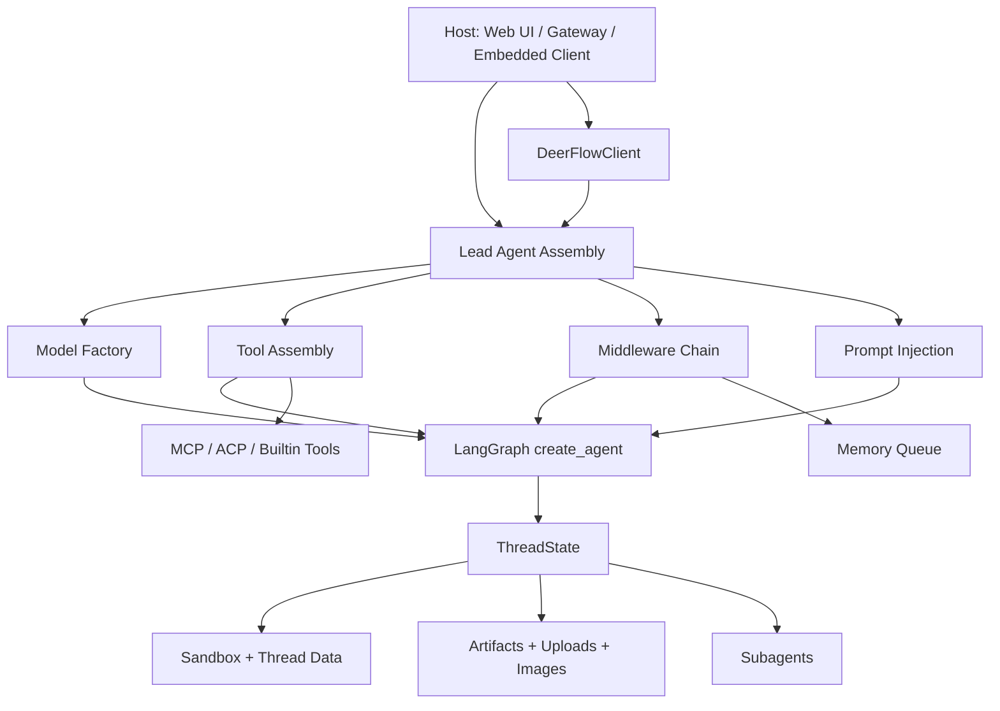

# DeerFlow 运行时内核层深度分析

## 说明

这份文档聚焦 `backend/packages/harness/deerflow/`，也就是 DeerFlow 作为一个可复用 Agent 平台的运行时内核。

分析重点不是 Web UI，而是 DeerFlow 自身作为 runtime 的本质能力，包括：

- agent factory
- middleware orchestration
- sandbox abstraction
- tool assembly
- model factory
- MCP integration
- skills loading
- memory
- subagents
- embedded client

如果只用一句话概括这一层，我会这样定义：

DeerFlow 的核心不是“一个大而全的 Agent”，而是“一个可组合、可嵌入、带安全边界的 Agent runtime”。

## 总体判断

这一层可以被理解为五个东西叠在一起：

1. 状态机
   以 `ThreadState` 为中心，把对话、sandbox、thread 文件目录、artifacts、memory 相关痕迹收束到一个统一状态总线里。

2. 中间件治理层
   DeerFlow 不是把功能硬塞进 prompt 或工具里，而是大量通过 middleware 处理上传、sandbox 生命周期、tool error、loop detection、memory 排队、clarification 等治理问题。

3. 能力注册表
   模型、工具、MCP、skills、ACP、subagents 都不是硬编码绑定，而是通过配置和装配点按需组合。

4. 执行边界
   真正让 DeerFlow 从“聊天机器人”变成“可执行代理平台”的关键，是 sandbox 抽象、路径校验和 thread 级文件隔离。

5. 可嵌入宿主接口
   `DeerFlowClient` 证明这层并不依赖 Web UI、Gateway 或 LangGraph Server 进程才能存在；它可以被直接嵌入任意 Python 进程中。

## 运行时结构图



## 主执行链路

如果从主 agent 的创建过程往下看，核心执行链其实很清楚：

`make_lead_agent()`
-> 解析运行时配置
-> `create_chat_model()`
-> `get_available_tools()`
-> `_build_middlewares()`
-> `apply_prompt_template()`
-> `create_agent(..., state_schema=ThreadState)`

最重要的是，这条链不是“先写 prompt，再加几个工具”，而是先搭好 runtime 骨架，再把 prompt、tools、model 当作可替换部件装进去。

### 关键代码片段：lead agent 的最终装配

```python
return create_agent(
    model=create_chat_model(
        name=model_name,
        thinking_enabled=thinking_enabled,
        reasoning_effort=reasoning_effort,
    ),
    tools=get_available_tools(
        model_name=model_name,
        groups=agent_config.tool_groups if agent_config else None,
        subagent_enabled=subagent_enabled,
    ),
    middleware=_build_middlewares(
        config,
        model_name=model_name,
        agent_name=agent_name,
    ),
    system_prompt=apply_prompt_template(
        subagent_enabled=subagent_enabled,
        max_concurrent_subagents=max_concurrent_subagents,
        agent_name=agent_name,
    ),
    state_schema=ThreadState,
)
```

这段代码很能说明 DeerFlow 的设计思路：真正的“内核”不是 prompt，而是 `model + tools + middleware + state_schema` 的统一装配。

## 一、状态总线：`ThreadState`

`ThreadState` 是 DeerFlow 内核里最值得先看懂的类型。它继承自 LangChain 的 `AgentState`，但扩展了 DeerFlow 自己真正关心的运行时状态：

- `sandbox`
- `thread_data`
- `title`
- `artifacts`
- `todos`
- `uploaded_files`
- `viewed_images`

其中有两个细节很关键：

1. `artifacts` 和 `viewed_images` 不是简单覆盖，而是用 reducer 合并。
   这意味着 DeerFlow 默认把这些字段当作“累积状态”，不是一次性变量。

2. `thread_id` 不放在 `ThreadState` 里，而是更多经由 runtime context/configurable 传递。
   这说明 DeerFlow 有意识地区分了“持久会话状态”和“本轮调用上下文”。

### 为什么这很重要

这会直接影响你对边界的理解：

- `ThreadState` 是 agent 可观察、可延续的状态面
- `runtime.context` 是调用期上下文面
- thread 目录和 sandbox 则是外部执行资源面

也就是说，DeerFlow 不是单一状态源，而是三个层次并存：

1. LangGraph state
2. runtime context
3. 文件系统 / sandbox 资源

这三层共同组成运行时。

## 二、Agent Factory：平台级工厂和应用级工厂分离

DeerFlow 在 agent factory 上做了一个很好的分层。

### 1. 平台级工厂：`create_deerflow_agent()`

`agents/factory.py` 里的 `create_deerflow_agent()` 很接近“纯装配函数”。

它的特点是：

- 直接接收 `model`、`tools`、`middleware`、`features`
- 自己尽量不读全局配置
- 支持 `RuntimeFeatures` 和 `extra_middleware`
- 面向“宿主方已经决定好依赖”的场景

这说明 DeerFlow 内核并不想把自己锁死在项目级配置体系里，它保留了一个更底层、更可复用的 API。

### 2. 应用级工厂：`make_lead_agent()`

`agents/lead_agent/agent.py` 里的 `make_lead_agent()` 则更偏应用层装配器。

它负责：

- 解析请求级参数，例如 `model_name`、`thinking_enabled`、`subagent_enabled`
- 读取 agent 配置
- 判断模型能力是否支持 thinking / vision
- 注入 trace metadata
- 生成最终 lead agent

### 设计含义

这其实是两层工厂：

- `create_deerflow_agent()` 负责“如何组装 agent”
- `make_lead_agent()` 负责“在 DeerFlow 应用里，应该组装出什么 agent”

这个分层很像“内核 API”和“产品默认装配”之间的界线。

## 三、Middleware Orchestration：middleware 是治理层，不是补丁层

DeerFlow 的 middleware 体系不是为了塞零碎功能，而是运行时治理的主舞台。

### 基础 runtime middleware 链

共享 runtime middleware 的构造逻辑在 `tool_error_handling_middleware.py`：

```python
middlewares = [
    ThreadDataMiddleware(lazy_init=lazy_init),
    SandboxMiddleware(lazy_init=lazy_init),
]

if include_uploads:
    middlewares.insert(1, UploadsMiddleware())

if include_dangling_tool_call_patch:
    middlewares.append(DanglingToolCallMiddleware())

middlewares.append(SandboxAuditMiddleware())
middlewares.append(ToolErrorHandlingMiddleware())
```

对 lead agent 来说，基础链大致是：

`ThreadData -> Uploads -> Sandbox -> DanglingToolCall -> Guardrail? -> SandboxAudit -> ToolErrorHandling`

### lead agent 的上层治理 middleware

然后 `_build_middlewares()` 再继续叠加：

- Summarization
- TodoList
- TokenUsage
- Title
- Memory
- ViewImage
- DeferredToolFilter
- SubagentLimit
- LoopDetection
- custom middlewares
- Clarification

### 设计哲学

这里最重要的点是：DeerFlow 把很多“平台行为”放在 middleware，而不是工具或 prompt 里。

这样做的好处是：

- 可以统一治理 lead agent 和 subagent 的共同行为
- 可以显式控制顺序
- 可以把“调用前后”的职责固定下来
- 可以把错误兜底、安全审计、loop 控制做成 runtime 机制，而不是提示词约束

### 真实权衡

middleware 顺序一旦变多，系统会变得非常强，但也更脆弱。

例如：

- `ViewImageMiddleware` 必须在模型调用前把图像细节注入
- `MemoryMiddleware` 必须在 agent 完成后再排队
- `ClarificationMiddleware` 必须压在最后

所以 DeerFlow 的运行时行为，已经不只是“有哪些 middleware”，而是“这些 middleware 以什么顺序组成一个协议”。

## 四、Sandbox Abstraction：执行边界是 DeerFlow 平台化的关键

我认为这是 DeerFlow 最接近“平台内核”的部分之一。

### 抽象层次

这一块大致分成四层：

1. `Sandbox`
   抽象执行环境接口。

2. `SandboxProvider`
   管理 sandbox 的创建、获取、释放、销毁。

3. `SandboxMiddleware`
   负责把 sandbox 生命周期挂到 agent 执行流程里。

4. `sandbox/tools.py`
   负责把具体工具请求映射到 sandbox 上执行。

### lazy init 的意义

`SandboxMiddleware` 默认 `lazy_init=True`，并不会在每轮 agent 开始时立刻创建 sandbox，而是在真正需要运行工具时才通过 `ensure_sandbox_initialized()` 获取。

### 关键代码片段：tool 调用时才懒初始化 sandbox

```python
if sandbox_state is not None:
    sandbox_id = sandbox_state.get("sandbox_id")
    if sandbox_id is not None:
        sandbox = get_sandbox_provider().get(sandbox_id)
        if sandbox is not None:
            runtime.context["sandbox_id"] = sandbox_id
            return sandbox

thread_id = runtime.context.get("thread_id")
provider = get_sandbox_provider()
sandbox_id = provider.acquire(thread_id)
runtime.state["sandbox"] = {"sandbox_id": sandbox_id}
```

这个设计说明 DeerFlow 的 sandbox 不是“线程一开始就强制准备好的资源”，而是“按需绑定到 thread state 上的执行能力”。

### 本地 sandbox 与 AIO sandbox 的差异

DeerFlow 至少支持两类实现：

- `LocalSandboxProvider`
- `AioSandboxProvider`

这两者最关键的区别不是接口，而是安全边界强弱不同。

在本地 provider 下，host bash 默认是禁用的，因为它不是真正的隔离边界。`sandbox/security.py` 里已经明确把这个风险写死为默认策略。

这意味着 DeerFlow 很清楚：

“能在本机执行命令”和“拥有安全隔离的执行环境”不是一回事。

### 路径安全

`sandbox/tools.py` 里对本地 sandbox 做了严格路径校验，核心意图是：

- 可写区只在 `/mnt/user-data`
- 技能目录 `/mnt/skills` 只读
- ACP 结果目录 `/mnt/acp-workspace` 只读

这一步非常关键，因为这决定了 DeerFlow 的工具层不是对宿主文件系统完全开放，而是对一组“虚拟化后的允许路径”开放。

### 关键代码片段：`bash_tool()` 不是直接执行命令，而是先做边界收缩

```python
sandbox = ensure_sandbox_initialized(runtime)
if is_local_sandbox(runtime):
    if not is_host_bash_allowed():
        return f"Error: {LOCAL_HOST_BASH_DISABLED_MESSAGE}"
    ensure_thread_directories_exist(runtime)
    thread_data = get_thread_data(runtime)
    validate_local_bash_command_paths(command, thread_data)
    command = replace_virtual_paths_in_command(command, thread_data)
    command = _apply_cwd_prefix(command, thread_data)
    output = sandbox.execute_command(command)
    return mask_local_paths_in_output(output, thread_data)
```

这里能看出 DeerFlow 的思路是：

- 先拿到 sandbox
- 再做目录准备
- 再做路径权限校验
- 再把虚拟路径翻译为实际路径
- 最后才执行

也就是说，工具不是直接碰执行器，而是要穿过一整层运行时安全协议。

### 一个容易误读但不是 bug 的点

`SandboxMiddleware.after_agent()` 每轮结束都会调用 `release()`，乍看像是“每轮都把 sandbox 释放了”。

但在 `AioSandboxProvider.release()` 里，`release` 的语义其实是：

- 从 active use 中移出
- 放回 warm pool
- 容器继续运行
- 只有在容量淘汰或 shutdown 时才真正 stop

所以这里不是自相矛盾，而是 provider 语义不同：

- middleware 负责“归还”
- provider 决定“归还后是热保留还是立即销毁”

## 五、Tool Assembly：tool 层是模型和 runtime 的契约面

`tools/tools.py` 里的 `get_available_tools()` 非常值得看，因为它几乎就是 DeerFlow 的能力装配中心。

工具来源主要有四类：

1. config tools
   通过 `tool.use` 反射加载。

2. builtin tools
   例如 `present_file`、`view_image`、`task`。

3. MCP tools
   从已启用 MCP server 动态加载。

4. ACP tool
   当配置了 ACP agents 时，暴露 `invoke_acp_agent`。

### 关键代码片段：工具是“按能力条件”拼起来的

```python
loaded_tools = [resolve_variable(tool.use, BaseTool) for tool in tool_configs]

builtin_tools = BUILTIN_TOOLS.copy()

if subagent_enabled:
    builtin_tools.extend(SUBAGENT_TOOLS)

if model_config is not None and model_config.supports_vision:
    builtin_tools.append(view_image_tool)

if include_mcp:
    mcp_tools = get_cached_mcp_tools()

if acp_agents:
    acp_tools.append(build_invoke_acp_agent_tool(acp_agents))
```

### 设计含义

DeerFlow 的工具层不是“固定工具箱”，而是一个 capability surface。

模型每次看到的工具集合，取决于：

- 当前模型是否支持 vision
- 当前是否开启 subagent
- 当前有没有启用 MCP
- 当前有没有 ACP agents
- 当前 sandbox 是否允许 host bash

所以 DeerFlow 的 tool system 更像“运行时协商后的接口面”，不是静态 API。

### 一个很好的细节

当 `tool_search` 开启时，MCP tools 不一定全部直接暴露给模型，而是可以先注册到 deferred registry，再通过 `tool_search` 让模型按需发现。

这说明 DeerFlow 已经开始处理“工具过多导致上下文膨胀”的平台级问题。

## 六、Model Factory：模型差异在工厂层被吸收

`models/factory.py` 的价值，在于它把“模型配置”和“模型适配”分开了。

它的工作大致包括：

- 通过 `model_config.use` 反射找到模型类
- 把 config 里和运行无关的描述字段排除掉
- 合并 `thinking` / `when_thinking_enabled`
- 在不支持 thinking 或 reasoning_effort 时做能力降级
- 对 Codex 类模型做专门参数适配
- 如果开启 tracing，则自动挂 tracer

### 设计哲学

这里的核心不是“创建模型对象”，而是“把模型差异封装在工厂里”。

这样上层 agent 装配就不需要知道：

- Anthropic thinking 参数怎么传
- OpenAI/Codex reasoning_effort 怎么映射
- tracing callbacks 什么时候附加

换句话说，DeerFlow 试图把“供应商差异”收束在 model factory，不让这些细节污染 lead agent 逻辑。

## 七、MCP Integration：MCP 是外部能力总线，不是内核插件

DeerFlow 对 MCP 的接入方式相当成熟，已经不只是“加载几个远程工具”。

### 配置驱动

MCP 的真实来源是 `extensions_config.json`，不是写死在 Python 代码里。

`mcp/client.py` 负责把配置转成 `MultiServerMCPClient` 可识别的 server params，支持：

- `stdio`
- `sse`
- `http`

### 缓存与失效

`mcp/cache.py` 里用 mtime 检查配置文件是否变化，一旦变更就重置缓存并重新初始化。

这背后的意图很明确：

Gateway API 可能在另一个进程里修改扩展配置，runtime 必须感知到。

### OAuth

`mcp/oauth.py` 里有一个 `OAuthTokenManager`，负责：

- 为不同 server 缓存 token
- 在即将过期时刷新
- 在 tool request 前动态注入 `Authorization` header

这说明 DeerFlow 把 MCP 当成真正的外部服务集成面来设计，而不是开发时玩具接口。

### 同步包装

一个很有工程味的细节是：MCP tools 可能只有 async 调用，但 DeerFlow 的某些流式消费路径是同步的，所以 `mcp/tools.py` 会给 async tool 补一个 sync wrapper。

这一步很重要，因为它表明 DeerFlow 不是简单依赖 MCP 库，而是在做宿主适配。

### 边界判断

MCP 在 DeerFlow 里的角色更像“外部能力总线”：

- 工具 schema 被引入 DeerFlow
- 调用被 DeerFlow runtime 包装
- 但服务本身仍在 DeerFlow 外部

所以 DeerFlow 并没有把 MCP server 纳入自己内核，而是把它做成可热配置的外部能力层。

## 八、Skills Loading：skills 是运行时可见知识资产，不是 Python 插件

DeerFlow 的 skills 设计非常有意思，因为它没有把 skill 做成 Python 扩展，而是做成一组可被 runtime 感知的文件资产。

### skill 的真实形态

一个 skill 的核心是 `SKILL.md`，其中 frontmatter 承载元数据，例如：

- name
- description
- license

`skills/loader.py` 负责扫描 `skills/public` 和 `skills/custom`，解析 skill 文件，并根据 `extensions_config.json` 决定是否 enabled。

### prompt 注入，而不是代码注入

更关键的是，skill 的使用方式是在 prompt 层暴露：

- `get_skills_prompt_section()` 会把已启用 skills 注入 `<skill_system>`
- 每个 skill 会被提供名字、描述和容器内路径
- prompt 明确要求 agent 采用 progressive loading 模式

这意味着 DeerFlow 的 skill 不是“运行时执行插件”，而是“运行时可发现的工作流知识包”。

### 设计优点

这样做有几个好处：

- skill 安装和启停非常轻
- 不需要执行任意 Python 扩展代码
- skill 可以天然容器化挂载到 `/mnt/skills`
- prompt 可以指导 agent 按需读取 skill 文件，而不是一次性把全文塞进上下文

### 安装器的安全性

`skills/installer.py` 的安装流程会：

- 验证 `.skill` ZIP
- 安全解包
- 解析并校验 frontmatter
- 拒绝危险 skill 名称和重复安装

说明 DeerFlow 把 skill distribution 当成一个正式能力，而不是开发者私下复制目录。

## 九、Memory：记忆系统是异步的、抽取式的、最终一致的

DeerFlow 的 memory 不是“每轮对话立刻写回状态”，而是一个异步更新管线。

### 运行时职责拆分

这一块分得很清楚：

1. `MemoryMiddleware`
   只负责在 agent 完成后筛消息并排队。

2. `MemoryUpdateQueue`
   负责 debounce、per-thread 去重和批处理。

3. `MemoryUpdater`
   负责调用 LLM，把会话抽取成结构化 summary/facts。

4. `FileMemoryStorage`
   负责缓存、持久化和原子写盘。

### 关键设计点

`MemoryMiddleware` 并不把整段消息全塞进记忆，而是只保留：

- 用户消息
- 最终 assistant 响应

tool call 和中间噪音会被过滤掉。

这表明 DeerFlow 的 memory 是“用户可感知语义记忆”，不是完整运行日志。

### debounce 队列

`MemoryUpdateQueue` 里最关键的设计是：

- 同一个 thread 的待处理更新会被新版本替换
- 多次会话更新通过 timer 做 debounce
- 真正处理发生在后台

这能避免每轮对话都立刻触发一次昂贵的 LLM 总结。

### LLM 抽取与清洗

`MemoryUpdater` 会：

- 读取当前记忆
- 组装 conversation prompt
- 调模型生成结构化 JSON 更新
- 合并 summary/facts
- 去掉上传文件痕迹
- 再落盘

“去掉上传文件痕迹”这个细节非常成熟，因为上传文件是 session scoped 的，如果把它们写进长期记忆，后续轮次会导致 agent 误以为这些文件长期存在。

### 存储层

`FileMemoryStorage` 做了两个重要工作：

- mtime 缓存
- temp file + replace 的原子写

所以 DeerFlow 的 memory 虽然简单，但它不是随便写个 JSON 文件，而是考虑了并发读写和长期运行时的一致性。

### 这层的边界

memory 不属于当前回合的严格控制流，而是“回合之后”的辅助认知层。

也就是说：

- 当前回合用 `ThreadState`
- 跨回合长期偏好和背景用 memory

这是 DeerFlow 里一个很清晰的短期状态 / 长期记忆分工。

## 十、Subagents：DeerFlow 的结构性能力之一

我认为 subagents 和 memory 一起，构成了 DeerFlow 区别于普通 tool-calling chat 的两项结构性能力。

### `task_tool` 只是入口，不是执行器

从模型视角看，subagent 只是一个 `task` 工具。

但后端真正干活的是：

- `task_tool()`
- `SubagentExecutor`

`task_tool()` 做的事情包括：

- 读取 subagent config
- 根据 runtime 提取父 agent 的 `sandbox_state`、`thread_data`、`thread_id`
- 获取父模型名和 trace id
- 重新装配一组不给 `task` 的工具
- 创建 `SubagentExecutor`
- 在后端启动异步执行

### 关键代码片段：subagent 继承执行环境，但不继承 `task`

```python
tools = get_available_tools(model_name=parent_model, subagent_enabled=False)

executor = SubagentExecutor(
    config=config,
    tools=tools,
    parent_model=parent_model,
    sandbox_state=sandbox_state,
    thread_data=thread_data,
    thread_id=thread_id,
    trace_id=trace_id,
)
```

这里有两个特别关键的边界：

1. subagent 共享父级 thread 执行环境
   sandbox 和 thread_data 直接传下去。

2. subagent 不允许继续暴露 `task`
   这是为了防止无限递归嵌套。

### `SubagentExecutor` 的本质

`SubagentExecutor` 并不是简单起一个线程跑函数，它本质上是在后端再创建一个完整 agent：

- 新模型实例
- 新 middleware 链
- 新 `ThreadState`
- 独立 system prompt

只是它继承了父线程的执行资源上下文。

### 两层线程池

`execute_async()` 的设计也很讲究：

- scheduler pool 负责后台任务调度
- execution pool 负责真正执行 subagent

然后结果会放进 `_background_tasks`，由后端轮询和更新状态。

### 为什么这很重要

这意味着 DeerFlow 把“后台并发子任务”做成了 runtime 功能，而不是让主模型自己学会轮询 `task_status`。

也就是：

- 模型只负责发起 delegation
- runtime 负责托管执行、超时、状态推进和结果回收

这是一种很典型的平台化设计。

## 十一、Embedded Client：这层不是 Web UI 附庸

`client.py` 是证明 DeerFlow 运行时内核可独立存在的最强证据。

### `DeerFlowClient` 做了什么

它允许宿主应用直接在进程内：

- 创建和缓存 agent
- 发起 `stream()` / `chat()`
- 查询模型、skills、memory、MCP 配置
- 安装 skill
- 上传文件
- 读取 artifacts

也就是说，LangGraph Server 和 Gateway API 提供的大量能力，`DeerFlowClient` 都有进程内等价物。

### 为什么这很关键

如果一个系统只有 Web API 能调用它，那它更像一个产品后端。

而 `DeerFlowClient` 的存在说明 DeerFlow 的真正内核是：

- 一个可直接嵌入 Python 宿主的 agent runtime
- Web UI 只是其中一种前端

### 与服务器协议对齐

`stream()` 还特意把输出事件做成接近 LangGraph SSE 协议的形状：

- `values`
- `messages-tuple`
- `end`

这意味着 DeerFlow 在设计 embedded mode 时，考虑的是协议兼容，而不是另起一套完全不同的调用模型。

### 一个重要边界

`DeerFlowClient` 文档里明确说明：

- 没有 checkpointer 时，多轮上下文并不会因为 `thread_id` 自动保留
- `thread_id` 这时更多只用于文件隔离

这说明 DeerFlow 对“对话状态”和“thread 资源隔离”是刻意拆开的。

## 十二、Prompt 注入层：skills、memory、deferred tools、subagents 都是可组合提示上下文

虽然这次重点不是 prompt engineering，但 `agents/lead_agent/prompt.py` 在 DeerFlow 内核里仍然很重要，因为它承担了“把 runtime 能力翻译成模型可理解上下文”的职责。

`apply_prompt_template()` 会动态拼接：

- `<memory>`
- `<skill_system>`
- deferred tools section
- subagent section
- ACP section
- 当前日期

这说明 DeerFlow 的 prompt 层不是静态模板，而是 runtime 能力表面的文本投影。

这里要特别注意一个边界：

- 真正的权限控制在 runtime
- prompt 只负责“告诉模型有哪些能力、怎样用更好”

所以 DeerFlow 并不是靠 prompt 保安全，而是 runtime 和 prompt 两层同时工作。

## 十三、设计优点

### 1. 运行时优先，而不是产品优先

DeerFlow 的核心能力并不围绕 UI 展开，而是围绕 agent runtime 展开。

### 2. 平台装配点足够清晰

模型、工具、MCP、skills、subagents、memory 都有明确装配入口，彼此没有完全耦死。

### 3. 安全边界是显式设计的

sandbox、路径校验、host bash 默认关闭、只读目录约束，这些都说明 DeerFlow 认真对待“代理执行”的风险。

### 4. middleware 成熟度高

很多项目的 middleware 只是拦日志；DeerFlow 的 middleware 已经承担了 runtime 治理主职责。

### 5. embedded client 非常加分

这一步把 DeerFlow 从“一个应用”推向了“一个平台”。

## 十四、真实权衡与潜在复杂度

### 1. 配置反射很灵活，但静态可见性变弱

`use` 字段反射加载模型和工具，扩展性很好，但阅读代码时不如显式依赖直观。

### 2. 状态分散在多个平面

`ThreadState`、runtime context、configurable、文件系统目录、memory 文件，这几层一起构成真实运行态。灵活，但理解成本高。

### 3. middleware 顺序是隐含协议

顺序一旦调整，行为可能变化很大。可扩展，但需要非常谨慎地维护顺序语义。

### 4. prompt 可见能力和 runtime 真能力可能出现漂移

例如 skills、deferred tools、subagent 说明主要通过 prompt 暴露，如果 prompt 拼装和底层可用性不一致，就可能产生认知偏差。

### 5. sandbox 生命周期语义不够一眼看懂

`release()` 在不同 provider 下含义不同，这种抽象很有弹性，但阅读者容易误判。

## 十五、我对 DeerFlow 内核本质的最终定义

如果我要给这一层下一个最准确的定义，我会说：

DeerFlow 内核是一个以 `ThreadState` 为状态总线、以 middleware 为治理骨架、以 tool/model/skill/MCP/subagent 为可插拔能力面、以 sandbox 为执行边界、并可通过 embedded client 嵌入宿主应用的 Agent runtime。

它不是 Web UI 的后端细节，也不是一堆 prompt 和工具的拼接，而是一个具有平台意识的运行时内核。

## 十六、建议阅读顺序

如果你准备继续往更深处读源码，我建议按这个顺序走：

1. `agents/thread_state.py`
   先搞清 DeerFlow 把哪些东西放进 state，哪些放在 context。

2. `agents/lead_agent/agent.py`
   看主 agent 是怎么被装出来的。

3. `agents/middlewares/`
   看 runtime 治理层怎么组织。

4. `tools/tools.py`
   看能力是怎么汇总和暴露给模型的。

5. `sandbox/tools.py` 和 `sandbox/middleware.py`
   看执行边界是如何真正生效的。

6. `subagents/executor.py`
   看 DeerFlow 怎么把 delegation 做成后台 runtime 能力。

7. `client.py`
   看这层如何脱离 Web UI 独立存在。

## 十七、最值得继续深挖的三个问题

如果你下一轮想继续深挖，我建议优先研究这三个点：

1. `ThreadState`、checkpointer、thread filesystem 之间到底哪些是持久、哪些是临时
2. middleware 顺序一旦变化，会对 lead agent 行为产生哪些具体回归
3. subagent 与 MCP / sandbox / memory 之间，哪些能力是共享的，哪些是故意隔离的
