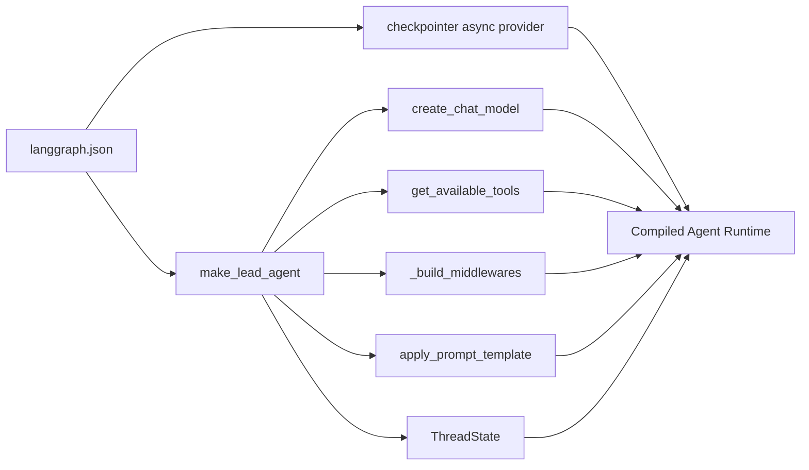
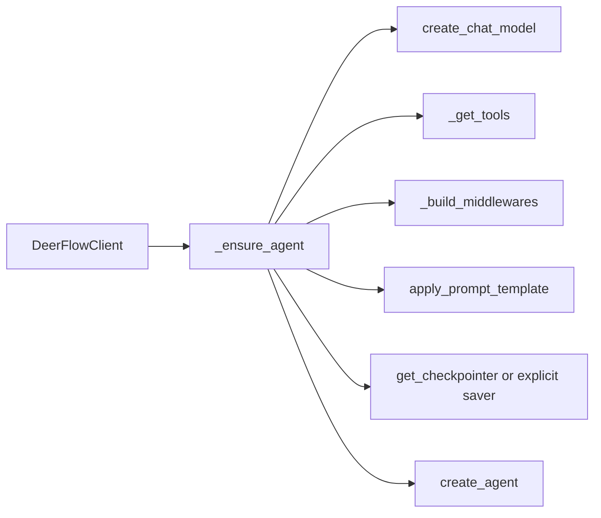
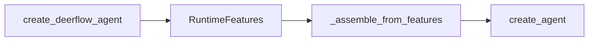

# Harness Learning 00: 总览与 0-1 掌握路线

这份文档不是某个单点专题，而是整个 DeerFlow harness 的学习总地图。

目标不是“知道有哪些目录”，而是建立这三个层面的理解：

- 原理：它为什么要这样设计
- 思想：它如何划分边界、状态、能力、执行面
- 集成：外部应用怎样接入它，而不是被它绑死

> 当前进度：`checkpointer` 已完成学习，对应 [01-checkpointer-state-model.md](d:/dev/github/deer-flow-analysis/docs/harness_learning/01-checkpointer-state-model.md)。

## 一、先给 Harness 一个准确定位

DeerFlow harness 不是 DeerFlow Web 应用的内部实现细节，它更接近一个“可复用 Agent Runtime Kernel”。

你可以把它压缩成下面这条公式：

```text
Harness
= Agent 装配层
+ 状态总线
+ 中间件治理层
+ 能力注册表
+ 执行边界
+ 持久化接口
+ 交付形态（Server / Embedded / SDK）
```

换句话说，它做的不是单纯的 prompt 拼接，而是把一个 agent 运行时真正需要的这些面拼到一起：

- `model`
- `system_prompt`
- `tools`
- `middleware`
- `state_schema`
- `checkpointer`
- `runtime context/configurable`

## 二、最重要的边界：Harness 和 App 是两层

这是理解全局结构的第一前提。

- Harness：`backend/packages/harness/deerflow/`
- App：`backend/app/`

依赖方向被明确限制为：

```text
app -> deerflow
deerflow -/-> app
```

这个边界有专门测试保证，[test_harness_boundary.py](d:/dev/github/deer-flow-analysis/backend/tests/test_harness_boundary.py) 会阻止 harness 反向 import app。

这意味着：

- harness 是可发布、可嵌入的运行时内核
- app 是 DeerFlow 自己的 HTTP、Gateway、IM 渠道适配层
- 学 harness 时，要一直站在“平台内核”视角，不要站在 Web 应用视角

## 三、整体模块地图

从目录结构看，harness 可以分成 12 个大块：

| 模块 | 目录 | 作用 |
| --- | --- | --- |
| agent assembly | `agents/` | 组装主 agent、状态、middleware、checkpointer |
| config | `config/` | 统一配置模型、路径、扩展、memory、sandbox、skills 等 |
| models | `models/` | 从配置反射构建 LLM 实例 |
| tools | `tools/` | 统一装配 config tools、builtin tools、MCP tools、ACP tools |
| sandbox | `sandbox/` | 执行隔离、虚拟路径、工作区生命周期 |
| mcp | `mcp/` | 外部 MCP server 接入与缓存 |
| skills | `skills/` | SKILL.md 扫描、解析、启用状态加载 |
| memory | `agents/memory/` | 长期语义记忆抽取与存储 |
| subagents | `subagents/` | 子代理配置、执行引擎、后台并发 |
| uploads | `uploads/` | 线程级上传文件管理 |
| reflection | `reflection/` | 通过字符串路径动态导入类和变量 |
| community | `community/` | 社区工具和可选执行后端 |

## 四、运行时主链

理解 harness，不要按目录顺序读，要按“系统怎么跑起来”读。

### 4.1 LangGraph Server 路径



这是 DeerFlow 官方服务模式的主链。

关键入口：

- [langgraph.json](d:/dev/github/deer-flow-analysis/backend/langgraph.json)
- [agents/lead_agent/agent.py](d:/dev/github/deer-flow-analysis/backend/packages/harness/deerflow/agents/lead_agent/agent.py)
- [agents/checkpointer/async_provider.py](d:/dev/github/deer-flow-analysis/backend/packages/harness/deerflow/agents/checkpointer/async_provider.py)

### 4.2 Embedded Client 路径



这是宿主应用最容易直接利用的一条链。

关键入口：

- [client.py](d:/dev/github/deer-flow-analysis/backend/packages/harness/deerflow/client.py)

### 4.3 SDK Factory 路径



这是更偏“平台嵌入”的底层接入方式。

关键入口：

- [agents/factory.py](d:/dev/github/deer-flow-analysis/backend/packages/harness/deerflow/agents/factory.py)

## 五、Harness 的核心设计思想

这是你后面每学一个模块都要反复回来的主线。

### 5.1 状态不是散的，而是围绕 `ThreadState`

短中期会话状态被集中到 `ThreadState` 这张状态面上。

### 5.2 治理逻辑不硬塞进 prompt，而是放进 middleware

上传、sandbox 生命周期、tool error、title、memory、loop detection、clarification，这些都主要走 middleware，而不是写成“提示词约定”。

### 5.3 工具不是硬编码列表，而是能力注册表

`get_available_tools()` 会组合：

- config 定义工具
- built-in tools
- MCP tools
- ACP tools
- subagent tool

这是一种“能力面装配”而不是“固定 agent profile”。

### 5.4 配置不是静态常量，而是运行时反射装配

模型类、工具变量、sandbox provider 都可以通过路径字符串解析。

### 5.5 sandbox 是执行边界，不只是命令工具

sandbox 不是单个 `bash_tool`，而是一套线程工作区、虚拟路径、provider 生命周期、隔离策略。

### 5.6 DeerFlow 提供多种交付形态，而不是只能跑在官方 Web UI 后面

它至少有三种接入姿势：

- LangGraph Server
- Embedded `DeerFlowClient`
- 低层 `create_deerflow_agent()`

## 六、你应该如何理解每个关键目录

### 6.1 `agents/`

这是 harness 的心脏层。

重点职责：

- `lead_agent/agent.py`：主 agent 装配入口
- `lead_agent/prompt.py`：系统提示词模板拼装
- `thread_state.py`：状态总线
- `middlewares/`：治理骨架
- `checkpointer/`：状态持久化
- `memory/`：长期记忆
- `factory.py`：更偏 SDK 的纯参数构建入口

学习时要把它看成：

```text
agent runtime control plane
```

### 6.2 `config/`

这是运行时配置中心。

它不只是读 `config.yaml`，还负责：

- 全局配置缓存
- 扩展配置读取
- skills / memory / checkpointer / sandbox 等子配置分发
- 路径系统

学习时要把它看成：

```text
runtime configuration spine
```

### 6.3 `models/`

这层负责把“配置上的模型声明”变成真正的模型实例。

核心思想不是 provider 细节，而是：

- 配置驱动
- thinking / reasoning / vision 能力适配
- tracing 注入

### 6.4 `tools/`

这层是能力装配器，不是单纯工具仓库。

核心文件：

- [tools/tools.py](d:/dev/github/deer-flow-analysis/backend/packages/harness/deerflow/tools/tools.py)

它做的关键事情是：

- 从 config 加载工具
- 补 built-in tools
- 判断是否注入 subagent tool
- 判断模型是否支持 image tool
- 读扩展配置接 MCP tools
- 注入 ACP tool

### 6.5 `sandbox/`

这层决定 agent 能不能在受控环境里读写文件、跑命令、产生 artifact。

它是“执行边界系统”，不只是若干工具函数。

### 6.6 `mcp/`

这层负责把外部能力服务器转成 agent 可调用工具。

核心思想：

- 多 server 聚合
- 缓存与 mtime 失效
- OAuth/header 注入
- async tool 到 sync tool 的兼容包装

### 6.7 `skills/`

这层不是插件执行器，而是“工作流知识包系统”。

它主要做：

- 扫描 `SKILL.md`
- 解析前置信息
- 读取启用状态
- 注入到 prompt 里

### 6.8 `subagents/`

这层是 DeerFlow 的结构性能力之一。

它不是简单地“再开一个 agent”，而是：

- 有独立配置
- 有后台执行引擎
- 有结果状态跟踪
- 复用父线程的部分上下文资源

### 6.9 `uploads/` 与 `config/paths.py`

这是 thread filesystem 的关键入口。

这一层把：

- `thread_id`
- thread 目录
- uploads / workspace / outputs
- 虚拟路径映射

串成可执行的资源模型。

### 6.10 `reflection/`

这是 DeerFlow 很像“平台内核”而不是“业务项目”的一个强信号。

它让很多部件可以用字符串路径声明，再运行时导入。

## 七、从 0 到 1 的学习路线

下面是我为你重新排过的一条掌握路径。它不是按目录排序，而是按理解依赖排序。

### Phase 0：边界与总心智模型

目标：

- 明确 harness 和 app 是两层
- 明确 harness 不是 UI 后端细节，而是 agent runtime
- 明确三种交付模式：server / embedded / SDK

关键文件：

- [backend/CLAUDE.md](d:/dev/github/deer-flow-analysis/backend/CLAUDE.md)
- [backend/tests/test_harness_boundary.py](d:/dev/github/deer-flow-analysis/backend/tests/test_harness_boundary.py)
- [backend/packages/harness/pyproject.toml](d:/dev/github/deer-flow-analysis/backend/packages/harness/pyproject.toml)

你学完后必须能回答：

- 为什么 harness 必须禁止 import app
- 为什么 `DeerFlowClient` 是 harness 独立性的强证据
- 为什么 `create_deerflow_agent()` 适合做宿主集成入口

### Phase 1：状态与持久化

状态：已完成

目标：

- 理解 `ThreadState`
- 理解 `thread_id`
- 理解 `checkpointer`
- 理解 thread filesystem 与 memory 的边界

学习资料：

- [01-checkpointer-state-model.md](d:/dev/github/deer-flow-analysis/docs/harness_learning/01-checkpointer-state-model.md)

### Phase 2：主 Agent 装配

目标：

- 看懂 DeerFlow 主 agent 是怎样被组起来的
- 看懂 prompt / model / tools / middleware / state_schema 是如何汇合的

关键文件：

- [agents/lead_agent/agent.py](d:/dev/github/deer-flow-analysis/backend/packages/harness/deerflow/agents/lead_agent/agent.py)
- [agents/lead_agent/prompt.py](d:/dev/github/deer-flow-analysis/backend/packages/harness/deerflow/agents/lead_agent/prompt.py)
- [models/factory.py](d:/dev/github/deer-flow-analysis/backend/packages/harness/deerflow/models/factory.py)
- [tools/tools.py](d:/dev/github/deer-flow-analysis/backend/packages/harness/deerflow/tools/tools.py)

你学完后必须能回答：

- `make_lead_agent()` 究竟装配了什么
- prompt 是怎么拼出来的
- 为什么 DeerFlow 真正的核心不是 prompt，而是装配过程

### Phase 3：Middleware 治理骨架

目标：

- 理解 middleware 在 DeerFlow 里的地位
- 理解为什么很多行为不写进 prompt，而写进 middleware
- 理解顺序为什么是隐含协议

关键文件：

- `agents/middlewares/*.py`
- [agents/lead_agent/agent.py](d:/dev/github/deer-flow-analysis/backend/packages/harness/deerflow/agents/lead_agent/agent.py)

尤其重点：

- `thread_data_middleware.py`
- `uploads_middleware.py`
- `tool_error_handling_middleware.py`
- `title_middleware.py`
- `memory_middleware.py`
- `clarification_middleware.py`
- `loop_detection_middleware.py`

你学完后必须能回答：

- 哪些逻辑属于“治理”
- 为什么 clarification 必须放在最后
- middleware 顺序一变，可能造成什么回归

### Phase 4：Tool 能力装配系统

目标：

- 理解 agent 为什么能动态拿到这么多工具
- 理解 config tools、builtins、MCP、ACP、subagent tool 是怎么汇合的

关键文件：

- [tools/tools.py](d:/dev/github/deer-flow-analysis/backend/packages/harness/deerflow/tools/tools.py)
- `tools/builtins/*.py`
- [reflection/resolvers.py](d:/dev/github/deer-flow-analysis/backend/packages/harness/deerflow/reflection/resolvers.py)

你学完后必须能回答：

- `get_available_tools()` 的装配顺序是什么
- 为什么 reflection 是这套系统的关键基础设施
- 什么能力是 prompt 注入，什么能力是真工具注入

### Phase 5：Sandbox 与线程资源模型

目标：

- 理解 DeerFlow 的执行边界
- 理解 thread 文件目录、虚拟路径、sandbox provider 是怎么联动的

关键文件：

- [sandbox/middleware.py](d:/dev/github/deer-flow-analysis/backend/packages/harness/deerflow/sandbox/middleware.py)
- `sandbox/sandbox_provider.py`
- `sandbox/tools.py`
- [config/paths.py](d:/dev/github/deer-flow-analysis/backend/packages/harness/deerflow/config/paths.py)
- `sandbox/local/*`

你学完后必须能回答：

- sandbox 是如何跟 `thread_id` 绑定的
- `/mnt/user-data/...` 和真实路径的关系是什么
- 为什么 thread filesystem 与 checkpointer 是两层

### Phase 6：MCP、Skills 与扩展装配

目标：

- 理解外部能力如何注入 harness
- 理解 skills 为什么是“知识包”，不是代码插件

关键文件：

- [mcp/tools.py](d:/dev/github/deer-flow-analysis/backend/packages/harness/deerflow/mcp/tools.py)
- `mcp/client.py`
- [skills/loader.py](d:/dev/github/deer-flow-analysis/backend/packages/harness/deerflow/skills/loader.py)
- `config/extensions_config.py`
- [agents/lead_agent/prompt.py](d:/dev/github/deer-flow-analysis/backend/packages/harness/deerflow/agents/lead_agent/prompt.py)

你学完后必须能回答：

- MCP tools 怎么从外部 server 进到 agent
- 为什么 extensions_config.json 需要单独存在
- skill 是怎样影响系统 prompt 的

### Phase 7：Memory、Title、Summarization

目标：

- 理解 DeerFlow 如何处理长期记忆与上下文压缩
- 理解这些能力为什么不是 checkpointer 的替代

关键文件：

- [agents/memory/updater.py](d:/dev/github/deer-flow-analysis/backend/packages/harness/deerflow/agents/memory/updater.py)
- `agents/memory/storage.py`
- `agents/memory/queue.py`
- `config/memory_config.py`
- `config/summarization_config.py`
- `agents/middlewares/title_middleware.py`

你学完后必须能回答：

- checkpointer 和 memory 的职责边界
- summarization 为什么属于“上下文治理”而不是长期记忆
- title 为什么适合做 middleware，而不是业务字段

### Phase 8：Subagents 与 ACP

目标：

- 理解 DeerFlow 怎么把 delegation 做成运行时能力
- 理解父 agent 与子 agent 的共享和隔离边界

关键文件：

- [subagents/executor.py](d:/dev/github/deer-flow-analysis/backend/packages/harness/deerflow/subagents/executor.py)
- `subagents/config.py`
- `subagents/registry.py`
- `tools/builtins/task_tool.py`
- `tools/builtins/invoke_acp_agent_tool.py`

你学完后必须能回答：

- 子代理继承了父代理的哪些上下文
- 为什么并发限制要在 middleware 层做
- ACP 和 subagent 的边界是什么

### Phase 9：外部应用接入

目标：

- 理解 harness 如何被宿主应用接入
- 理解三种集成模式的边界与取舍

三种模式如下。

#### 模式 A：直接跑官方 Server / Gateway

适合：

- 想最少改动先跑通
- 接前端、IM 渠道、LangGraph Studio

路径：

- `langgraph.json`
- `app/gateway/*`
- `app/channels/*`

#### 模式 B：嵌入 `DeerFlowClient`

适合：

- 宿主应用自己就是 Python 后端
- 不想再额外起 LangGraph Server / Gateway
- 需要直接在进程内拿流式事件和管理能力

关键文件：

- [client.py](d:/dev/github/deer-flow-analysis/backend/packages/harness/deerflow/client.py)

#### 模式 C：低层嵌入 `create_deerflow_agent()`

适合：

- 你想保留自己的 API、消息存储、prompt 管理、工具管控
- 只把 DeerFlow 当成 agent runtime kernel

关键文件：

- [agents/factory.py](d:/dev/github/deer-flow-analysis/backend/packages/harness/deerflow/agents/factory.py)
- [docs/plans/2026-03-30-deerflow-integration-blueprint.md](d:/dev/github/deer-flow-analysis/docs/plans/2026-03-30-deerflow-integration-blueprint.md)

### Phase 10：做一个最小宿主集成样例

目标：

- 真正把“理解”变成“能接”

建议练习：

1. 用 `create_deerflow_agent()` 起一个最小 agent
2. 显式传入 `checkpointer`
3. 让现有 `conversation_id` 映射为 `thread_id`
4. 接入一个 MCP server
5. 保留宿主自己的消息表
6. 区分消息历史、checkpointer、memory 三个存储面

## 八、推荐学习顺序

后面我会按下面这个顺序继续教你：

1. 总心智模型与三条运行链
2. 主 agent 装配
3. middleware 骨架
4. tools 与 reflection
5. sandbox 与 thread filesystem
6. MCP 与 skills
7. memory 与 summarization
8. subagents 与 ACP
9. 三种外部接入模式对比
10. 做最小集成蓝图

## 九、你真正要掌握的不是“文件”，而是这五个问题

如果你最后能稳定回答下面五个问题，说明 harness 基本就吃透了。

1. DeerFlow harness 的最小运行时由哪些部件组成
2. 哪些是状态层，哪些是治理层，哪些是能力层，哪些是执行层
3. 哪些状态在 `ThreadState`，哪些在 thread filesystem，哪些在 memory
4. 外部能力是如何通过 config、reflection、MCP、skills 被装配进来的
5. 外部应用应该在 Server、Client、Factory 三种接入方式里怎么选

## 十、后续教学策略

从下一轮开始，我会按“课程式”方式继续带你学，每一轮固定拆成这六步：

1. 这个模块解决什么问题
2. 它在全局运行链的什么位置
3. 关键代码入口在哪
4. 真实执行时数据怎么流动
5. 外部集成时你需要关注什么
6. 最后用一张图或一张边界表收束

## 最短总结

Harness 的本质不是“一个 agent 项目”，而是一个带有明确边界、状态总线、中间件治理、能力装配、执行边界与多种交付形态的 agent runtime kernel。

你已经完成了 `checkpointer` 这一块。接下来最正确的下一步不是继续钻局部，而是转去学 `make_lead_agent()` 这条主装配链，因为它是把整个 harness 串起来的第一主入口。
