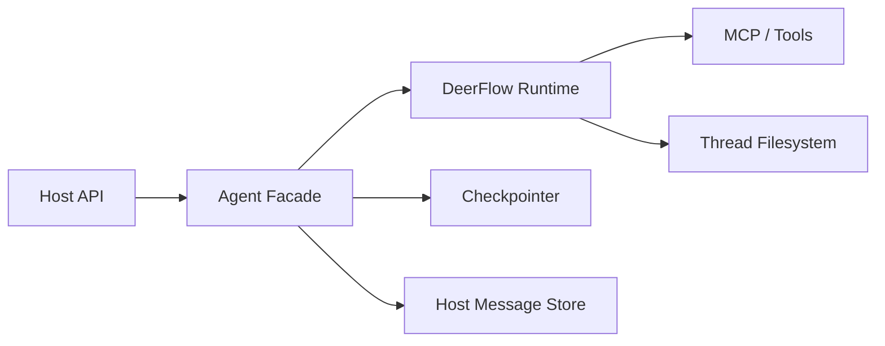

# Harness Learning 10: 最小宿主集成蓝图

这一篇不是继续讲概念，而是把前面学到的内容收束成一个最小可落地接入蓝图。

目标是回答：

```text
如果我要把 DeerFlow harness 接进自己的系统，最小正确姿势是什么？
```

## 1. 推荐默认路线

如果你的宿主是 Python 后端，我最推荐的默认起点是：

```text
先用 create_deerflow_agent() 或 DeerFlowClient 做最小内嵌
```

原因是：

- 保持控制权
- 集成面清晰
- 容易逐步引入 MCP、memory、subagents

## 2. 最小架构



## 3. 最小职责分工

### 宿主应用负责

- API 协议
- 用户鉴权
- 消息审计与搜索
- conversation/session 管理
- 业务权限和业务规则

### DeerFlow runtime 负责

- agent 装配
- runtime state
- middleware 治理
- tools / MCP / subagents
- sandbox/thread filesystem
- checkpointer

## 4. 最小接入步骤

### Step 1：确定线程键

让宿主 `conversation_id` 与 DeerFlow `thread_id` 做稳定映射。

### Step 2：起一个最小 runtime

可以用：

- `DeerFlowClient`
- 或 `create_deerflow_agent(...)`

### Step 3：接入 checkpointer

优先明确：

- 单进程开发：SQLite
- 多实例部署：Postgres

### Step 4：保留宿主消息表

不要试图让 checkpointer 取代消息表。

推荐分工：

- 消息表：用户可见历史、审计、搜索
- checkpointer：agent runtime state

### Step 5：再逐步增加 MCP / skills / memory

不要一上来全开。

最稳妥顺序通常是：

1. 主 agent 跑通
2. checkpointer 跑通
3. MCP 跑通
4. skills 跑通
5. memory 跑通
6. subagents 跑通

## 5. 最小代码心智模型

你可以把外部宿主里的接入层想成一个 `AgentFacade`：

```text
Host Request
-> map conversation_id to thread_id
-> call DeerFlow runtime
-> stream events back
-> persist final assistant message to host store
```

这层很重要，因为它把：

- DeerFlow runtime
- 业务协议
- 存储策略

隔离开了。

## 6. 最容易犯的错

### 错误 1：把 checkpointer 当消息历史

不对，它保存的是 runtime state，不是产品层会话记录。

### 错误 2：把 memory 当消息表

不对，它是长期语义记忆，不是完整对话归档。

### 错误 3：一开始把所有能力全开

最容易导致系统边界不清、定位问题困难。

### 错误 4：宿主与 DeerFlow 都各自管理一套 thread 语义却不映射

后果通常是状态错位、文件错位、审计错位。

## 7. 你完成这篇后应该具备什么能力

你应该能自己画出一张接入图，并明确：

- 哪些归宿主管
- 哪些归 DeerFlow runtime
- `thread_id` 怎么映射
- checkpointer 用哪种 backend
- 是否先用 client 还是 factory

## 最短总结

最小正确接入 DeerFlow harness 的关键，不是“先把所有功能跑起来”，而是先把线程映射、状态边界、消息存储和运行时装配这四个核心边界理清，再逐步打开扩展能力。
